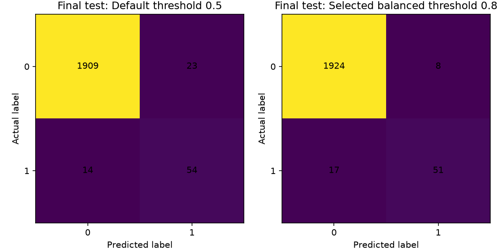
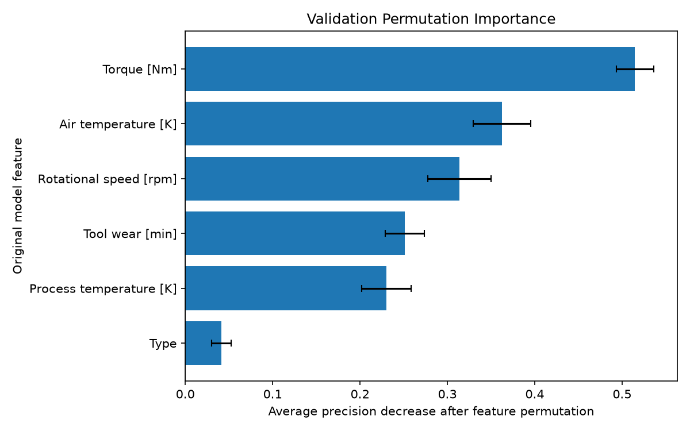
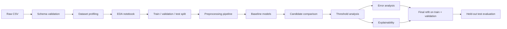
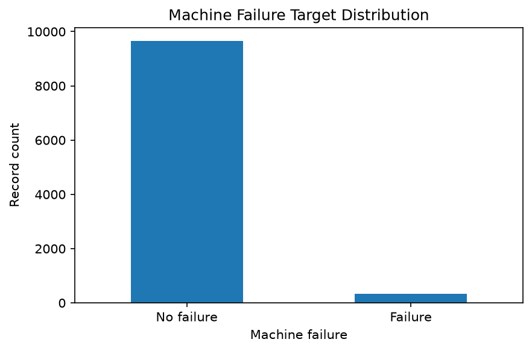

# Predictive Maintenance ML Pipeline

End-to-end, reproducible binary-classification workflow for machine-failure risk using Python, pandas, and scikit-learn.

[](https://github.com/MarynaG05/predictive-maintenance-ml/actions/workflows/ci.yml)


## Executive Summary

This project uses the public UCI AI4I 2020 Predictive Maintenance dataset to demonstrate a complete machine-learning workflow for machine-failure risk classification. The repository includes local data ingestion, schema validation, profiling, EDA, leakage-safe feature handling, reproducible preprocessing, model comparison, threshold analysis, explainability, and final held-out test evaluation. Identifier columns and failure-mode outcome columns are deliberately excluded from model features to avoid leakage. Model and threshold decisions are made on train and validation data, then frozen before the final test evaluation. The selected final model is `hist_gradient_boosting_balanced` with a validation-derived balanced threshold of `0.8`. On the untouched final test split, the model reaches ROC-AUC `0.9639`, average precision `0.8351`, precision `0.8644`, recall `0.7500`, and F1 `0.8031`.

## Business Problem

Unexpected equipment failures create downtime, emergency repair costs, missed production commitments, and avoidable operational risk. A predictive maintenance workflow helps maintenance teams identify high-risk operating conditions before a failure is observed.

This project frames machine failure prediction as decision support. The model is designed to help prioritize inspections and maintenance review; it is not an autonomous maintenance decision system.

## What This Project Demonstrates

- Production-style Python project structure with a `src/` package layout
- Local CSV ingestion with schema validation and duplicate-header safeguards
- Reusable dataset profiling and documented data acquisition
- Leakage prevention for identifiers, target, and failure-mode columns
- Reproducible preprocessing with scikit-learn `Pipeline`
- Imbalanced-class modeling with validation-first evaluation
- Baseline and candidate model comparison
- Validation threshold analysis for business operating points
- Validation error analysis for false positives and false negatives
- Validation permutation importance with logical feature names
- Final refit on development data and untouched test evaluation
- Persisted final model artifact and batch prediction interface
- Automated tests, Ruff checks, pre-commit hooks, and GitHub Actions CI

## Final Model and Operating Point

| Item | Value |
| --- | --- |
| Final model | `hist_gradient_boosting_balanced` |
| Operating profile | `balanced` |
| Selected threshold | `0.8` |
| Threshold source | Validation business recommendation workflow |
| Final test usage | Held out until model and threshold were frozen |

The final test set was not used for model selection, threshold selection, feature selection, or model refitting decisions.

## Final Held-Out Test Results

Final test results at the selected balanced threshold `0.8`:

| Metric | Value |
| --- | ---: |
| ROC-AUC | 0.9639 |
| Average precision | 0.8351 |
| Accuracy | 0.9875 |
| Precision | 0.8644 |
| Recall | 0.7500 |
| F1 | 0.8031 |
| True negatives | 1924 |
| False positives | 8 |
| False negatives | 17 |
| True positives | 51 |



The figure compares the default `0.5` threshold with the selected `0.8` operating threshold on the final held-out test set.

## Threshold Trade-Off

Threshold selection was performed on validation data only. The business profiles reflect different operating preferences:

| Profile | Threshold | Precision | Recall | F1 | False positives | False negatives | Predicted positives | Illustrative cost |
| --- | ---: | ---: | ---: | ---: | ---: | ---: | ---: | ---: |
| `high_recall` | 0.05 | 0.3631 | 0.8971 | 0.5169 | 107 | 7 | 168 | 177.0 |
| `balanced` | 0.80 | 0.7288 | 0.6324 | 0.6772 | 16 | 25 | 59 | 266.0 |
| `conservative` | 0.80 | 0.7288 | 0.6324 | 0.6772 | 16 | 25 | 59 | 266.0 |

The `balanced` and `conservative` profiles converge to the same validation threshold here because different rules chose the same operating point. They may differ on another dataset or under different business constraints.

## Model Comparison

Average precision is the primary selection metric because machine failures are rare and precision-recall behavior is more informative than accuracy alone for the positive failure class.

| Model | Validation average precision |
| --- | ---: |
| `dummy_prior` | 0.0340 |
| `logistic_regression_balanced` | 0.3679 |
| `random_forest_balanced` | 0.6448 |
| `hist_gradient_boosting_balanced` | 0.7173 |

The HistGradientBoosting model was selected before final test evaluation based on validation performance.

## Explainability

Permutation importance was computed on the validation split using average-precision degradation after feature permutation. The reported features are the original logical model features; one-hot encoded `Type` columns are not exposed as separate business features.

| Rank | Feature | Importance mean |
| ---: | --- | ---: |
| 1 | `Torque [Nm]` | 0.514849 |
| 2 | `Air temperature [K]` | 0.362717 |
| 3 | `Rotational speed [rpm]` | 0.313981 |
| 4 | `Tool wear [min]` | 0.251310 |
| 5 | `Process temperature [K]` | 0.230222 |
| 6 | `Type` | 0.041294 |



Higher permutation importance means validation average precision decreased more when that feature was shuffled. It does not imply causality, direction of effect, or production impact. Importance is model-specific and validation-split-specific, and correlated features may share or mask importance.

## Error Analysis

At the validation best-F1 threshold `0.8`, the model produced:

| Metric | Value |
| --- | ---: |
| False positives | 16 |
| False negatives | 25 |
| Validation precision | 0.7288 |
| Validation recall | 0.6324 |
| Validation F1 | 0.6772 |

False positives represent unnecessary inspections, while false negatives represent missed failures. Lower thresholds reduce missed failures but increase workload; higher thresholds reduce false alarms but can miss more failures. Feature differences are descriptive, not causal.

## Batch Prediction

The Version 1 interface loads the persisted `predictive_maintenance_pipeline.joblib` artifact and `model_metadata.json`, validates that input columns match `config.MODEL_FEATURES`, runs `predict_proba()`, and applies the metadata-derived operating threshold. The output table contains `failure_probability` and `predicted_failure`; no retraining, model selection, threshold optimization, or evaluation is performed.

## ML Workflow



## Repository Structure

```text
predictive-maintenance-ml/
├── .github/workflows/        # GitHub Actions CI
├── data/raw/                 # Local raw dataset, ignored by Git
├── docs/                     # Specification, architecture, case study, results
├── notebooks/                # Executed EDA notebook
├── reports/                  # Local generated reports, ignored by Git
├── src/predictive_maintenance/
│   ├── data.py               # CSV loading
│   ├── validation.py         # Structural schema validation
│   ├── profiling.py          # Dataset profile summaries
│   ├── preprocessing.py      # Feature preprocessing pipeline
│   ├── models.py             # Model factories
│   ├── train.py              # Model comparison workflow
│   ├── thresholds.py         # Validation threshold analysis
│   ├── error_analysis.py     # Validation error analysis
│   ├── explainability.py     # Permutation importance
│   ├── recommendations.py    # Business operating profiles
│   ├── final_evaluation.py   # Frozen final test evaluation
│   ├── artifacts.py          # Final model artifact persistence
│   └── predict.py            # Batch prediction from persisted artifacts
└── tests/                    # Automated unit and workflow tests
```

## Installation

This project targets Python 3.11 or newer.

```bash
python3 -m venv .venv
source .venv/bin/activate
python -m pip install --upgrade pip
python -m pip install -e ".[dev]"
pre-commit install
```

## Dataset Setup

The dataset is not committed to the repository. Download the UCI AI4I 2020 Predictive Maintenance dataset manually and place it at:

```text
data/raw/ai4i2020.csv
```

See [docs/data_acquisition.md](docs/data_acquisition.md) for local setup and verification steps. No licensing claims are made here; verify current UCI licensing and citation details before reuse outside this portfolio project.



## Common Commands

Quality checks:

```bash
ruff check .
ruff format --check .
pytest
pre-commit run --all-files
```

Execute the EDA notebook with the project environment:

```bash
python - <<'PY'
from pathlib import Path
import nbformat
from nbclient import NotebookClient

path = Path("notebooks/01_exploratory_data_analysis.ipynb")
notebook = nbformat.read(path, as_version=4)
NotebookClient(notebook, timeout=600, kernel_name="python3").execute()
PY
```

Run the model comparison, threshold analysis, and final evaluation:

```bash
python -c "from predictive_maintenance.train import run_model_comparison; print(run_model_comparison()['best_validation_model'])"
python -c "from predictive_maintenance.thresholds import run_threshold_analysis as run; print({name: row['threshold'] for name, row in run()['selected_thresholds'].items()})"
python -c "from predictive_maintenance.final_evaluation import run_final_model_evaluation; print(run_final_model_evaluation()['selected_threshold_metrics'])"
```

Run batch prediction with a persisted local artifact:

```bash
python - <<'PY'
from predictive_maintenance import config
from predictive_maintenance.data import load_dataset
from predictive_maintenance.predict import run_batch_prediction

features = load_dataset().loc[:, config.MODEL_FEATURES]
result = run_batch_prediction(features, artifact_dir=config.MODELS_DIR / "final")
print(result["prediction_dataframe"].head())
PY
```

## Reproducibility and Governance

The workflow uses `RANDOM_SEED = 42` and a deterministic stratified 60/20/20 split. Preprocessing is fitted inside scikit-learn pipelines on the relevant training data. Model selection, threshold selection, error analysis, and explainability use train and validation data only; the final test split is used after the model and threshold are frozen.

Final-evaluation governance metadata is a process declaration, not technical prevention of reruns. The code reproduces the deterministic result, while the project process treats the approved first final evaluation as the final evidence for this version.

## Limitations

- The AI4I dataset is synthetic.
- Results come from a single public dataset and deterministic split.
- No external validation dataset is included.
- No real-time deployment, monitoring, or drift detection is implemented.
- Maintenance costs are illustrative and should be replaced with real operational costs.
- Permutation importance and error-analysis summaries are descriptive, not causal.
- Thresholds should be revalidated with real capacity, cost, and risk constraints.

## Project Status

Stable portfolio release: Version 1 is complete. The project demonstrates an offline, reproducible predictive-maintenance ML workflow with final artifact persistence and batch prediction. It is not production-ready without external validation, operational monitoring, and deployment hardening.

## Documentation Links

- [Project specification](docs/project_specification.md)
- [Data acquisition](docs/data_acquisition.md)
- [EDA notebook](notebooks/01_exploratory_data_analysis.ipynb)
- [Architecture](docs/architecture.md)
- [Portfolio case study](docs/portfolio_case_study.md)
- [Results summary](docs/results_summary.md)
- [Release notes](docs/release_notes.md)
