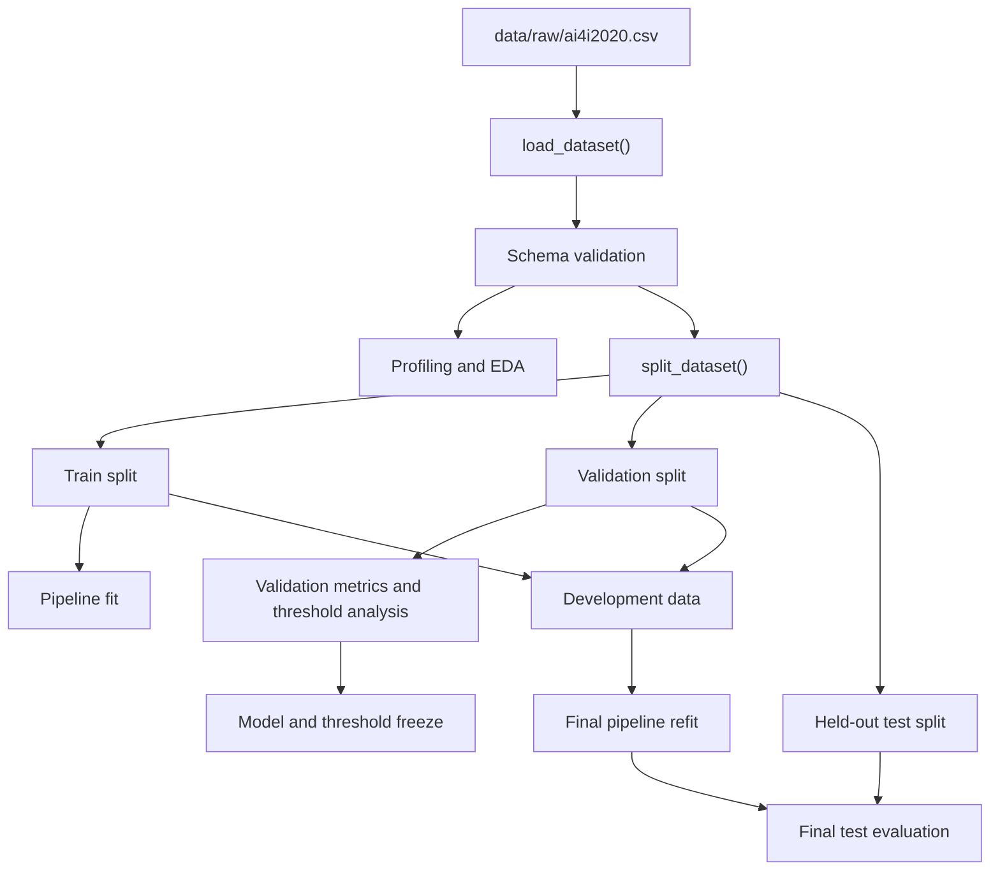
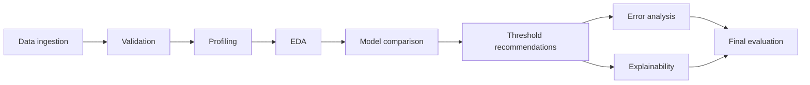

# Architecture

This document summarizes the project architecture for the predictive maintenance machine-learning workflow.

## Module Responsibilities

| Module | Responsibility |
| --- | --- |
| `config.py` | Central paths, dataset columns, feature groups, split sizes, and expected categorical values |
| `data.py` | CSV loading, source-header checks, local path handling, and deterministic returned columns |
| `validation.py` | Structural schema validation for required columns and duplicate DataFrame columns |
| `profiling.py` | Dataset profile summaries and JSON/CSV export |
| `preprocessing.py` | scikit-learn preprocessing pipeline for categorical and numerical features |
| `models.py` | Unfitted model factory functions for baseline and candidate models |
| `splitting.py` | Deterministic stratified train-validation-test split |
| `evaluation.py` | Binary model metric calculation and safe class-1 probability extraction |
| `train.py` | Baseline and candidate model comparison workflows |
| `thresholds.py` | Validation threshold grid evaluation and threshold selection utilities |
| `error_analysis.py` | Validation-only false-positive and false-negative analysis |
| `explainability.py` | Validation permutation importance on the fitted pipeline |
| `recommendations.py` | Business-oriented validation threshold profiles |
| `final_evaluation.py` | Frozen final model refit and held-out test evaluation |
| `exceptions.py` | Custom exception hierarchy for clear workflow failures |

## Data Flow



## Separation of Concerns

The codebase keeps data quality, modeling, validation analysis, business recommendations, and final test evaluation in separate modules. This avoids a single notebook-style workflow where data leakage or stateful assumptions can become difficult to audit.

Model factories return unfitted pipelines. Training workflows decide when and where fitting happens. Evaluation utilities assume fitted models and focus on metrics. Reporting functions export plain Python structures, CSV files, JSON files, and figures without saving fitted model artifacts.

## Train / Validation / Test Governance

The dataset is split deterministically with `RANDOM_SEED = 42` and a stratified 60/20/20 design:

- Training split: fit preprocessing and model parameters during model comparison.
- Validation split: compare models, analyze thresholds, inspect errors, and compute permutation importance.
- Final test split: held out until the final model and threshold are frozen.

For final evaluation, the selected model is refit on development data, defined as train plus validation. Test labels are not used for fitting, weighting, threshold selection, or explainability.

## Generated Artifacts

Generated local artifacts are written under `reports/` and can include:

- Dataset profiles
- Model comparison reports
- Threshold analysis reports
- Error-analysis tables
- Explainability reports
- Final evaluation reports
- Figures

The `reports/` directory is ignored by Git. Curated static images copied for portfolio documentation live in `docs/images/`.

## Ignored Local Data

Raw data is expected at:

```text
data/raw/ai4i2020.csv
```

The raw dataset is ignored by Git and should not be committed. See [data_acquisition.md](data_acquisition.md) for setup instructions.

## CI Responsibilities

GitHub Actions runs the project quality gate on push:

- Install the package with development dependencies
- Run Ruff linting
- Run Ruff formatting check
- Run pytest

CI does not download the raw dataset and does not depend on local generated reports.

## Workflow Summary


